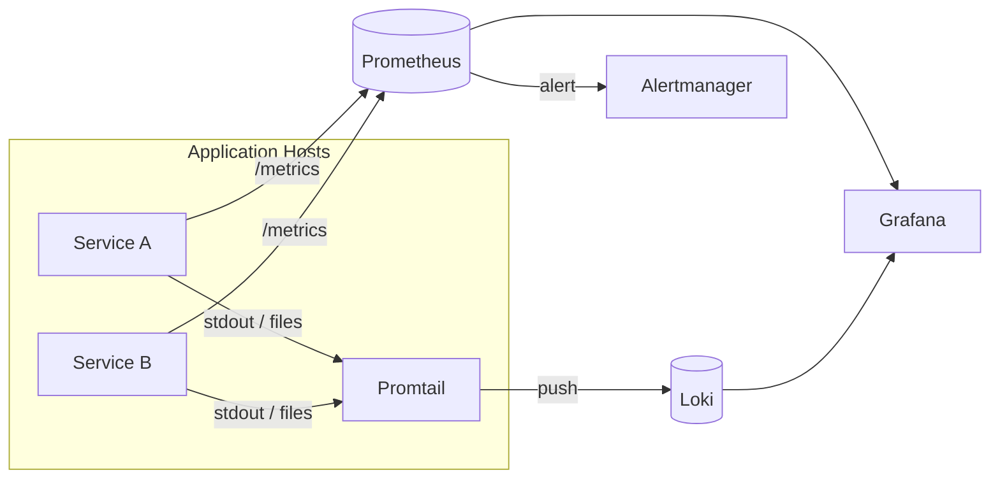

> **TL;DR** — Centralization is a forcing function: it exposes label discipline, retention cost, and the failure modes of the observability stack itself. Prometheus owns metrics, Loki owns logs, Promtail ships them. The hard part is not the tooling; it is keeping cardinality bounded and treating the pipeline as a system that can also fail.

As systems scale horizontally, observability stops being a local concern. Logs, metrics, and signals are no longer tied to a single machine, container, or instance.

> **Without centralization, observability collapses into noise.**

This article describes a centralized observability stack using Prometheus, Loki, and Promtail, focused on the operational decisions that determine whether it survives production rather than tooling hype.

## Architecture at a Glance



Three concerns, three components, one query surface (Grafana). The split matters: each tier has its own failure mode and its own scaling axis.

## Per-Instance Observability Does Not Scale

In single-host systems:

- Logs are local
- Metrics are inspected manually
- Failures are easy to correlate

In distributed systems:

- Instances are ephemeral
- Logs are scattered across pods that may be gone before you SSH in
- Failures span multiple services and require correlation by time and identifier

Debugging by jumping into individual containers becomes guesswork. Centralization is not optional — it is the only way to keep mean-time-to-diagnosis bounded.

## Metrics vs Logs: Different Signals, Different Roles

Metrics answer:

- *Is something wrong?*
- *When did it start?*
- *How widespread is it?*

Logs answer:

- *Why did it happen?*
- *What exactly failed?*
- *What was the execution path?*

Both are necessary, but the design rule is to **alert on metrics, debug with logs**. Logs are too high-volume and too unstructured to alert on directly without amplifying noise.

## Prometheus as the Metrics Aggregator

Prometheus collects metrics from all instances and stores them as time series.

Key properties:

- Pull-based scraping over HTTP
- Time-series store optimized for numeric data
- PromQL for slicing, aggregating, and alerting

Prometheus provides **system-level visibility** with predictable storage cost — as long as cardinality is controlled (more on that below).

## Loki: Logs Designed for Scale

Loki takes a different approach to logs:

- Indexes only metadata (labels), not full content
- Stores log content in cheap object storage (S3, GCS, or local disk)
- Queries with LogQL, a syntax intentionally similar to PromQL

This makes Loki cheap to operate at terabytes of logs, but it pays for that cheapness in query cost: filtering by content (`|=` or regex) requires scanning chunks. Design queries to **anchor on labels first**, then refine by content.

## Promtail: Shipping Logs to Loki

Promtail is the agent that tails files (or reads from systemd/Docker) and pushes them to Loki.

```yaml
server:
  http_listen_port: 9080

positions:
  filename: /tmp/positions.yaml

clients:
  - url: http://loki:3100/loki/api/v1/push

scrape_configs:
  - job_name: application
    static_configs:
      - targets:
          - localhost
        labels:
          job: backend
          service: orders
          env: production
          __path__: /var/log/app/*.log
```

The `positions.yaml` file tracks read offsets per file. If Promtail crashes, it resumes from the last acknowledged offset on restart. This is the entire durability story — there is no on-disk queue beyond the OS file cache.

## Label Strategy: The One Decision That Decides Cost

Labels in Prometheus and Loki define a **time series per unique combination of values**. High cardinality is the single most common cause of observability stack failure.

Use labels for:

- `service`, `env`, `region`, `cluster`
- `method`, `status`, `route` (where `route` is a templated path, not the raw URL)

Never use labels for:

- `user_id`, `tenant_id`, `request_id`, `trace_id`
- Raw URLs, raw error messages, full stack traces
- Anything unbounded or per-request

A practical guideline: **keep total active series per metric under ~10k**, and total active series per Prometheus instance under a few million. Loki has similar limits per stream. Whenever you are tempted to add a high-cardinality label, ask whether the value belongs in the **log line** (Loki content) or as an **exemplar** linked to a histogram bucket (Prometheus exemplars), not as a label.

## Correlating Metrics and Logs

Centralization becomes powerful when metrics and logs share the same identity space.

A reliable correlation flow:

1. Prometheus alert fires on `rate(http_requests_total{status="5xx"}[5m]) > 0.02`
2. Alert annotation contains a Grafana link with the matching Loki query: `{service="orders", env="production"} |= "ERROR"`
3. Engineer lands directly on the relevant log window
4. Recovery is observed in the same metric

The shared label set (`service`, `env`) is what makes this work. Without consistent labels across the two systems, correlation is manual and slow.

## Multi-Environment Observability

Production observability must scale across regions, data centers, and clusters. The conventional set:

- `env` — `production`, `staging`, `dev`
- `region` — `us-east-1`, `eu-west-1`
- `cluster` — k8s cluster name or equivalent

These three labels cover almost every operational slicing question without exploding cardinality, because each has bounded values.

## What Breaks in Production

Treat the observability stack as a system with failure modes of its own.

- **Loki is down.** Promtail keeps tailing files and updates `positions.yaml` only after successful push. On restart, it resumes — but if the host runs out of disk or the file is rotated and gone, that window is lost. Mitigation: keep file rotation conservative, and alert on `promtail_dropped_entries_total`.
- **Prometheus scrape fails.** Prometheus drops samples for the missed interval. There is no retry. Mitigation: keep scrape interval ≤ 30s and alert on `up == 0`.
- **High cardinality spike.** A new label value (e.g., `route` accidentally containing IDs) creates millions of series. Prometheus memory grows fast and OOMs. Mitigation: enforce `metric_relabel_configs` to drop unknown labels at scrape time.
- **Promtail can't reach Loki.** Without a persistent queue, sustained Loki downtime causes log loss once file rotation happens. Mitigation: log rotation policies aligned with worst-case Loki recovery time.

Observability infrastructure must tolerate failure itself. Otherwise it becomes the loudest pager during incidents that have nothing to do with it.

## Dashboards and Alerts as Interfaces

Dashboards are not decoration — they are operational interfaces.

Good dashboards:

- Lead with **symptoms** (latency, error rate, saturation), not internals
- Group by service, then by signal type (RED or USE)
- Are usable under stress, not only when curated

Alerts should trigger investigation, not panic. The bar: every alert must have a runbook link, an owner, and a clear remediation. If an alert lacks any of those, it is noise.

## Key Takeaways

- Centralization solves correlation; it does not eliminate cost. Cardinality discipline is what keeps the bill bounded.
- Alert on metrics, debug with logs. Use shared labels (`service`, `env`, `region`) to bridge the two.
- Treat Promtail's `positions.yaml` as the durability boundary — beyond it, sustained Loki downtime can drop logs.
- Dashboards should optimize for incident readability, not exploration.
- Every alert needs a runbook, an owner, and a remediation. Otherwise it becomes pager noise.

## See Also

- [Observability with Prometheus and Micrometer](/blog/observability-with-prometheus-and-micrometer) — instrumenting JVM services that feed this pipeline.
- [Designing Systems That Scale Horizontally](/blog/designing-systems-that-scale-horizontally) — why centralization matters once you have more than one instance.
