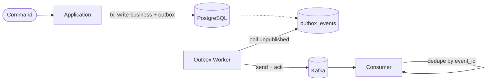

> **TL;DR** — Treat Kafka as eventually available, not always available. Persist business state first, publish via the outbox pattern, configure the producer for idempotence (default since Kafka 3.0), and make every consumer idempotent. Resilience is a property of the integration, not of the broker.

Kafka is often introduced as a *highly available* and *fault-tolerant* system. What is less discussed is a simple truth:

> **Kafka will eventually be unavailable.**

Brokers restart. Networks partition. KRaft or ZooKeeper has issues. Cloud zones fail. If your system assumes Kafka is *always* available, it is not resilient — it is fragile.

This article focuses on **how to design Kafka integrations that survive real failures**, without losing data or cascading outages.

## Resilience Architecture at a Glance



The critical path (`App → DB`) does not depend on Kafka. The async path (`Worker → Kafka → Consumer`) tolerates broker downtime by design.

## Kafka as a Dependency

From an application's perspective, Kafka is an external dependency. That means:

- It can be slow
- It can be temporarily unavailable
- It can partially fail (writes accepted but reads stale, leader unavailable, ISR shrinking)

Treating Kafka as "always on" couples business correctness to infrastructure health. Resilient systems **decouple business correctness from infrastructure availability**.

## Common Anti-Patterns

### 1. Synchronous Business Flow Depends on Kafka

```java
orderService.createOrder(order);
kafkaProducer.send(orderCreatedEvent); // critical path
```

If Kafka is down: order creation fails, users see errors, business stops. Kafka must **never** be on the synchronous business success path.

### 2. Retrying Blindly Until It Works

```java
while (true) {
  try {
    producer.send(event);
    break;
  } catch (Exception e) {
    Thread.sleep(1000);
  }
}
```

Threads pile up, backpressure propagates, the system collapses under load. Unbounded retries are denial-of-service bugs against your own service.

### 3. "Kafka Will Handle It"

Kafka guarantees durability *after* data is written to the log. It does **not** guarantee that your producer sent the event, that your transaction committed, or that your app didn't crash between DB commit and `send`. That gap is where most data loss happens.

## Design Principle: Kafka Is Eventually Available

> **The system must keep working even if Kafka is temporarily unavailable.**

That implies:

- Business data is persisted first, in your own database
- Events are delivered asynchronously, decoupled from request handling
- Failures are isolated to the delivery path and recoverable on retry

## The Outbox Pattern (Foundation of Resilience)

The outbox pattern replaces dual writes with a single atomic write to your database, plus an asynchronous publisher.

1. Write business data and the outbox event in the **same DB transaction**
2. A background worker reads unpublished events and sends them to Kafka
3. On successful send, mark the event as published
4. Retry failed sends with backoff

Schema:

```sql
CREATE TABLE outbox_events (
  id UUID PRIMARY KEY,
  aggregate_type TEXT NOT NULL,
  aggregate_id   TEXT NOT NULL,
  event_type     TEXT NOT NULL,
  payload        JSONB NOT NULL,
  created_at     TIMESTAMP NOT NULL DEFAULT now(),
  published_at   TIMESTAMP NULL
);

CREATE INDEX idx_outbox_unpublished
  ON outbox_events (created_at)
  WHERE published_at IS NULL;
```

Transactional write:

```java
@Transactional
public void createOrder(CreateOrderCommand cmd) {
  Order order = orderRepository.save(cmd.toOrder());

  OutboxEvent event = OutboxEvent.from(order);
  outboxRepository.save(event);
}
```

If the transaction commits, both the business state and the event exist. If it rolls back, neither does. **No gap, no lost events.**

For the deeper PostgreSQL-specific implementation see [Outbox Pattern with PostgreSQL in Practice](/blog/outbox-pattern-with-postgresql-in-practice).

## Producer Configuration That Actually Matters

Since Kafka 3.0, **`enable.idempotence` defaults to `true`**, which automatically forces:

- `acks=all`
- `retries=Integer.MAX_VALUE`
- `max.in.flight.requests.per.connection ≤ 5`

In practice, leaving the defaults and avoiding application-level resends is the right call:

```properties
# Most of these are now defaults; pinning them is documentation.
acks=all
enable.idempotence=true
max.in.flight.requests.per.connection=5
delivery.timeout.ms=120000
linger.ms=10
```

Idempotence is guaranteed only **within a single producer session**. If you swap producer instances or your process restarts, the broker cannot deduplicate retries across sessions — which is why consumer-side idempotency is still mandatory (see below).

For end-to-end exactly-once across topics, set a `transactional.id`:

```java
Properties props = new Properties();
props.put("bootstrap.servers", "kafka:9092");
props.put("transactional.id", "orders-tx-1"); // stable per producer instance

Producer<String, String> producer =
    new KafkaProducer<>(props, new StringSerializer(), new StringSerializer());

producer.initTransactions();
try {
    producer.beginTransaction();
    producer.send(new ProducerRecord<>("orders", id, payload));
    producer.commitTransaction();
} catch (ProducerFencedException | OutOfOrderSequenceException | AuthorizationException e) {
    // Unrecoverable: another instance fenced us, or auth changed.
    producer.close();
} catch (KafkaException e) {
    producer.abortTransaction();
}
```

For transactional EOS to actually hold, also configure:

- Topics involved in transactions: `replication.factor ≥ 3`, `min.insync.replicas = 2`
- Consumers: `isolation.level=read_committed`

Skipping any of these silently downgrades the guarantee.

## Idempotency on the Consumer Side

Retries happen. Producer rebalances happen. At-least-once is the practical default, even with idempotence enabled across sessions. **Consumers must be idempotent.**

```java
if (processedEventRepository.exists(eventId)) {
  return;
}

process(event);
processedEventRepository.save(eventId);
```

Two notes:

- The dedup table needs its own retention policy (rolling window, partitioned by date) or it grows unbounded.
- The dedup write must be in the same transaction as the side effects, otherwise you can lose the dedup record after the side effect ran.

## Handling Partial Kafka Failures

Kafka fails in subtle ways: leader unavailable, ISR shrinking, produce timeout, network partitions. The producer config above mitigates these — but configuration alone does not replace architectural safety.

A circuit breaker on the producer prevents the service from spending threads on a degraded broker:

```java
// Resilience4j sketch: 5 failures within 60s → open for 30s, half-open with 2 trial calls
CircuitBreakerConfig cfg = CircuitBreakerConfig.custom()
    .failureRateThreshold(50)
    .slidingWindowSize(20)
    .minimumNumberOfCalls(5)
    .waitDurationInOpenState(Duration.ofSeconds(30))
    .permittedNumberOfCallsInHalfOpenState(2)
    .build();
```

When the breaker is open, the outbox worker simply pauses publishing. Events accumulate in the outbox table — exactly what it is designed for.

## Observability: Know When Kafka Is Hurting You

Resilience without observability is blind optimism. Track:

- `outbox_events_pending` — unpublished count; growth = Kafka pressure
- `outbox_publish_latency_seconds` — histogram, watch p99
- `outbox_publish_failures_total` — error rate by exception class
- `kafka_producer_record_send_total` and `kafka_producer_record_error_total` — built-in client metrics

A growing outbox is not a failure — it is a signal. The system is doing the right thing: queueing events that will be delivered when Kafka recovers.

For instrumentation patterns, see [Observability with Prometheus and Micrometer](/blog/observability-with-prometheus-and-micrometer).

## Realistic Failure Scenarios

| Scenario | What Happens | Why It Holds |
|---|---|---|
| Kafka down for 10 minutes | Business continues, outbox grows, events delivered later | Outbox decouples persistence from delivery |
| App crash after DB commit | Event still in outbox, delivered on restart | Atomic write + worker recovery |
| Producer reconnects with new session | Possible duplicate sends | Consumer dedup absorbs the duplicate |
| Kafka recovers slowly under load | Backoff and circuit breaker prevent overload | Open breaker pauses worker; recovery is graceful |

This is operational resilience, not theoretical reliability.

## Key Takeaways

- Kafka is eventually available. The integration must keep working when it is not.
- Persist business state and outbox events in the same DB transaction. Kafka becomes async, never transactional with your DB.
- Trust the Kafka 3.0+ defaults: idempotence is on, `acks=all`, retries are infinite, `max.in.flight ≤ 5`. Don't override unless you know why.
- For exactly-once across topics: set `transactional.id`, replicate ≥ 3, `min.insync.replicas=2`, consumers `read_committed`.
- Consumers must be idempotent. Idempotence on the producer covers a session; consumers cover everything else.
- Observe the outbox, not just Kafka. Outbox growth tells you Kafka is hurting before users notice.

## See Also

- [Outbox Pattern with PostgreSQL in Practice](/blog/outbox-pattern-with-postgresql-in-practice) — the persistence side in depth.
- [Designing Systems That Scale Horizontally](/blog/designing-systems-that-scale-horizontally) — why idempotency is non-negotiable when you have more than one consumer.
- [Observability with Prometheus and Micrometer](/blog/observability-with-prometheus-and-micrometer) — instrumenting the producer and outbox worker.
