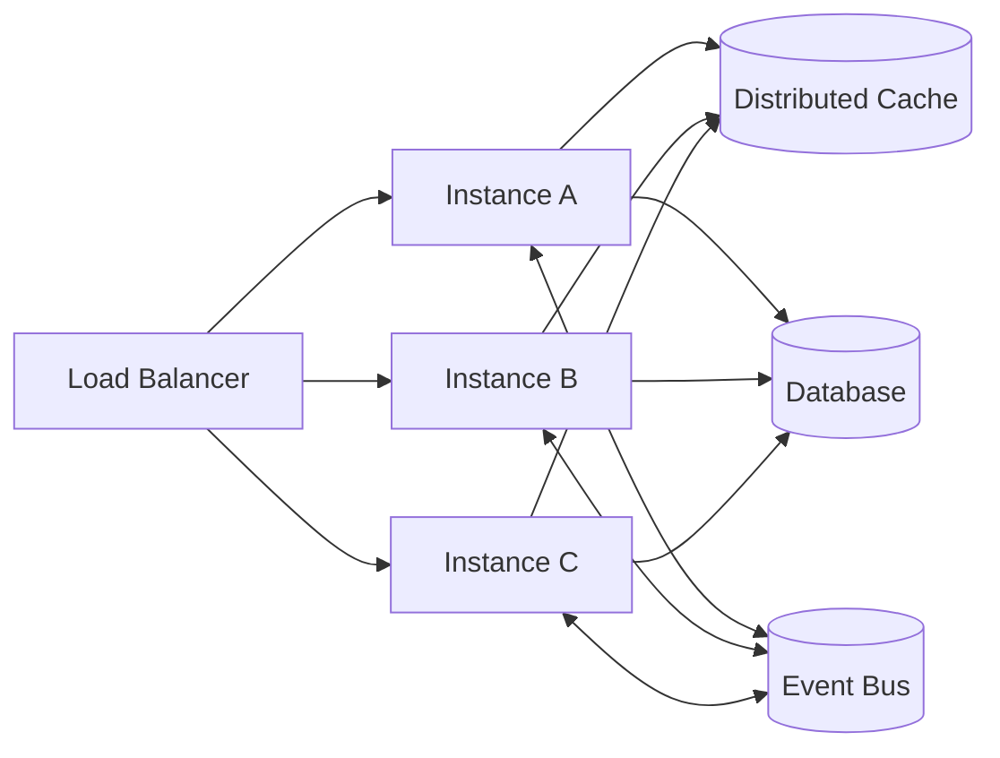

> **TL;DR** — Horizontal scaling is a design property, not a deploy step. The system has to be stateless, idempotent, and tolerant of concurrent execution. Get those three right and adding instances becomes boring; skip any of them and the second instance is where every bug lives.

Horizontal scalability is often described as *adding more instances*. In practice it is about something deeper:

> **Designing systems where adding instances does not change behavior.**

This article focuses on the architectural decisions that make or break multi-instance deployments — the things that look fine on one node and break on two.

---

## Topology at a Glance



State lives behind the instances, not inside them. Instances are interchangeable.

---

## The Illusion of Scalability

Many systems appear scalable in development:

- Single instance
- Local database
- In-memory state
- No contention

Then a second instance is deployed. Suddenly:

- Bugs appear
- Data races surface
- Events are duplicated
- Caches diverge

The system was never horizontally scalable — it was merely *replicable*. Replication is a deployment trick; scalability is an architectural property.

---

## Statelessness Is the First Requirement

A horizontally scalable service must be stateless from the perspective of any single request.

### Bad

```java
private final Map<String, Session> sessions = new HashMap<>();
```

This works only until traffic is load-balanced. Two instances, two divergent maps, lost sessions on every other request.

### Correct

State lives in:

- Durable databases for source-of-truth records
- Distributed caches (Redis, Memcached) for ephemeral, shared state
- External identity stores for sessions and tokens

Instances become interchangeable: any request can go to any instance and produce the same outcome.

---

## Load Balancing Strategies

The way requests are distributed shapes which problems show up:

- **Round-robin** — simplest, requires real statelessness. Default choice.
- **Sticky sessions (session affinity)** — pin a client to one instance. A workaround, not a solution; deployment rolls and node failures still break correctness, and cache locality drifts on rebalance.
- **Consistent hashing** — route by key (e.g., `tenant_id`) to maximize cache locality without hard-pinning. Useful for stateful caches with replication, not for HTTP services that should already be stateless.
- **Least-connections / least-latency** — adaptive; helps when request cost varies widely (e.g., AI inference).

If you reach for sticky sessions to make scaling work, the bug is upstream — something assumed local state. Fix that instead.

---

## Idempotency Everywhere

In multi-instance systems, retries happen by default:

- Clients retry on timeouts
- Load balancers retry on 5xx
- Event consumers redeliver on rebalance

Idempotency is not optional.

```java
if (processedRequests.exists(requestId)) {
  return existingResult(requestId);
}

Result result = handle(request);
processedRequests.save(requestId, result);
```

Without it: side effects multiply, data corruption follows, recovery becomes manual. With it, retries become safe and deployment becomes a non-event.

---

## Concurrency Is the Default State

Horizontal scaling means concurrent execution by default. Design assuming multiple writers, multiple consumers, and out-of-order execution.

The database becomes the arbiter of truth. Use conditional updates instead of read-then-write:

```sql
UPDATE orders
SET status = 'PAID'
WHERE id = :id
  AND status = 'PENDING';
```

If two instances race, the loser's update affects 0 rows and the application reacts accordingly. No locks, no coordination, no surprise overwrites.

---

## Single-Writer Tasks: Leader Election

Some tasks must run exactly once:

- Schedulers
- Batch jobs
- Maintenance tasks
- Outbox publishers (depending on design)

Three reasonable mechanisms:

- **PostgreSQL advisory locks** — simplest, no extra infra:
  ```sql
  SELECT pg_try_advisory_lock(12345);
  ```
- **`SELECT ... FOR UPDATE SKIP LOCKED`** for queue-style work distribution
- **etcd / ZooKeeper / Kubernetes leases** — when you already operate them

Pick the one with the smallest operational surface that holds your guarantees. Resist introducing a coordination service for a single use case.

---

## Cache Coherency

Caches in multi-instance systems are eventually consistent by default. Two strategies:

- **Time-bounded staleness** — set a TTL aligned with business tolerance. Simplest, works for most read paths.
- **Invalidation via events** — write side publishes a "cache key X is stale" event; readers invalidate locally on receipt. Lower staleness, higher complexity.

Avoid trying to keep caches strictly synchronized across instances. That is a distributed consensus problem in disguise; if you need it, the data probably should not be cached.

---

## Event-Driven Scaling

Event-driven architectures naturally support horizontal scaling:

- Producers are decoupled from consumers
- Consumers scale independently
- Load is distributed by partitions

Kafka consumer groups enforce one consumer per partition with automatic rebalancing. Scaling out is "increase partitions and consumers"; scaling in is the reverse. Idempotency on the consumer (see above) is what makes rebalances safe.

---

## Observability Across Instances

Without observability, scaling is blind.

Track per instance and aggregated:

- Request rate, error rate, latency (RED)
- Concurrency and queue depth
- Resource saturation (CPU, memory, IO)
- Consumer lag for event-driven flows

Correlation IDs propagated through requests and events are what makes a multi-instance trace readable. A request that flows through three instances and a Kafka topic should be one trace, not three.

For the underlying stack, see [Centralized Observability with Prometheus, Loki, and Promtail](/blog/centralized-observability-with-prometheus-loki-promtail).

---

## Failure Becomes Normal

In horizontally scaled systems:

- Instances die
- Deployments restart pods
- Networks glitch

This must be expected. Resilient systems restart cleanly, recover state externally, and resume processing safely. If a single restart causes lasting damage, the system is not actually horizontally scalable.

---

## Key Takeaways

- Horizontal scalability is a design property — statelessness, idempotency, concurrency-tolerance — not an infrastructure feature.
- Default to round-robin load balancing. Reach for sticky sessions only as a temporary patch.
- Make every mutating operation idempotent. Retries are not edge cases; they are the steady state.
- Use the database as the concurrency arbiter via conditional updates and advisory locks.
- Caches are eventually consistent. Use TTLs first; invalidate via events only when staleness budget is tight.
- Observability with correlation IDs is what makes multi-instance debugging possible.

---

## See Also

- [Designing Resilient Kafka Integrations](/blog/designing-resilient-kafka-integrations) — concurrent consumers and idempotency in event-driven flows.
- [PostgreSQL Partitioning in Practice](/blog/postgresql-partitioning-in-practice) — when the database itself becomes the bottleneck.
- [Centralized Observability with Prometheus, Loki, and Promtail](/blog/centralized-observability-with-prometheus-loki-promtail) — the observability stack behind multi-instance debugging.
