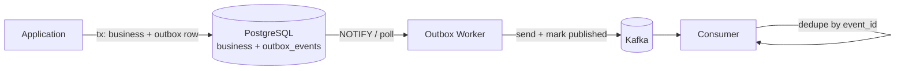

> **TL;DR** — The outbox pattern replaces the dual-write problem with a single atomic DB transaction plus an asynchronous publisher. PostgreSQL is a near-ideal fit thanks to ACID, JSONB, partial indexes, and `LISTEN/NOTIFY`. The hard part is operating it: polling cadence, dedup retention, and consumer idempotency.

In distributed systems, the hardest problem is not scalability or performance. It is **consistency across boundaries**. More precisely:

> **How do you guarantee that a database change and a Kafka event represent the same reality?**

This article walks through a production-grade implementation of the Outbox Pattern on PostgreSQL, focused on the operational concerns that decide whether it works under load.

---

## Outbox Flow



The atomic boundary is the DB transaction. The async boundary is the worker. The idempotency boundary is the consumer.

---

## The Core Problem: Dual Writes

A common integration flow:

```text
1. Write to database
2. Publish event to Kafka
```

It looks simple — until something fails.

- The database commit succeeds, but Kafka publish fails
- Kafka publish succeeds, but the database transaction rolls back
- The application crashes between the two operations
- Network partitions cause partial success

This is the **dual-write problem**. Without special handling it leads to lost events, ghost events, and divergence between systems.

---

## Why Distributed Transactions Are Not the Answer

Two-phase commit and XA appear attractive in theory. In practice:

- Kafka does not participate in XA transactions
- Availability is reduced (any participant down = blocked)
- Operational complexity is significant
- Failure recovery is harder, not easier

Modern systems avoid distributed transactions and prefer **local atomicity plus eventual consistency**.

---

## The Outbox Pattern, Briefly

Replace the dual write with a single atomic operation:

> **Persist business data and the integration event in the same database transaction.**

A separate process publishes events asynchronously. Kafka becomes async, never transactional.

---

## Why PostgreSQL Fits

- Strong ACID guarantees, single-node write consistency
- Native JSONB for opaque event payloads
- Partial indexes to keep the unpublished-event query fast
- `LISTEN` / `NOTIFY` for low-latency wakeups without polling
- `SELECT ... FOR UPDATE SKIP LOCKED` for safe concurrent worker fan-out
- Mature operational tooling (pgBackRest, logical replication, autovacuum)

---

## Schema

```sql
CREATE TABLE outbox_events (
  id             UUID PRIMARY KEY,
  aggregate_type TEXT NOT NULL,
  aggregate_id   TEXT NOT NULL,
  event_type     TEXT NOT NULL,
  payload        JSONB NOT NULL,
  created_at     TIMESTAMP NOT NULL DEFAULT now(),
  published_at   TIMESTAMP NULL
);

-- Partial index: only unpublished rows participate.
CREATE INDEX idx_outbox_unpublished
  ON outbox_events (created_at)
  WHERE published_at IS NULL;
```

The partial index is the trick that keeps the worker query cheap as the table grows. Once a row is published, it leaves the index entirely.

---

## Atomic Write

```java
@Transactional
public void createOrder(CreateOrderCommand command) {
  Order order = orderRepository.save(Order.from(command));

  OutboxEvent event = OutboxEvent.builder()
    .id(UUID.randomUUID())
    .aggregateType("Order")
    .aggregateId(order.getId().toString())
    .eventType("OrderCreated")
    .payload(toJson(order))
    .build();

  outboxRepository.save(event);
}
```

If the transaction commits, both rows exist. If it rolls back, neither does. **No gap.**

---

## Polling vs LISTEN/NOTIFY

The simplest worker polls:

```java
List<OutboxEvent> events =
  outboxRepository.findUnpublished(BATCH_SIZE);

for (OutboxEvent event : events) {
  try {
    kafkaProducer.send(event.toKafkaRecord()).get();
    outboxRepository.markAsPublished(event.id());
  } catch (Exception e) {
    // leave it; it will be picked up by the next iteration
  }
}
```

A 1–2 second poll interval works for most systems. Trade-off: latency floor equals poll interval.

For low-latency setups, combine polling with `LISTEN`/`NOTIFY`:

```sql
-- in the writing transaction (or a trigger):
NOTIFY outbox_new;
```

```java
// worker subscribes once and wakes up on notifications
listenerConnection.listen("outbox_new");
```

`NOTIFY` does not deliver payloads reliably (and is not durable across worker restarts), so always keep polling as the floor — `LISTEN` is a *latency optimization*, not a correctness mechanism.

For multiple worker instances, use `SELECT ... FOR UPDATE SKIP LOCKED` so each worker grabs disjoint rows:

```sql
SELECT id, payload
FROM outbox_events
WHERE published_at IS NULL
ORDER BY created_at
LIMIT 100
FOR UPDATE SKIP LOCKED;
```

This gives near-linear scalability up to a sane number of workers without coordination.

---

## What Breaks: Realistic Failure Modes

- **Worker crashes between `producer.send()` and `markAsPublished()`.** On restart, the row is still unpublished and gets re-sent. The consumer **must** dedup by `event.id`.
- **Worker is partitioned from Kafka.** The outbox grows. This is by design — alert on backlog size, not on individual failures.
- **Slow Kafka leader.** `producer.send().get()` blocks. Use a bounded thread pool or async sends with a callback that marks `published_at` only on success.
- **Outbox table grows unbounded.** `published_at IS NOT NULL` rows are dead weight. Either delete them after a retention window, or move them to an `outbox_events_archive` table partitioned by month.

---

## Idempotency on the Consumer

Retries imply duplicates. Consumers must dedup:

```java
@Transactional
public void handle(Event event) {
  if (processedEventRepository.exists(event.id())) {
    return;
  }
  process(event);
  processedEventRepository.save(event.id());
}
```

Two operational notes:

- `processed_events` needs its own retention (e.g., 30 days, partitioned by date) or it becomes the new bottleneck.
- Both the side-effect and the dedup write must be in the same transaction. If you write the dedup record outside the transaction, a crash between them re-runs the side effect.

---

## Operational Checklist

- Backlog metric: `outbox_events_pending` exposed as a gauge.
- Latency metric: time between `created_at` and `published_at`, p95 and p99.
- Failure metric: `outbox_publish_failures_total`, labeled by exception class.
- Retention: archive or delete published rows on a schedule.
- Worker liveness: alert on `published_at` not advancing for N minutes while `outbox_events_pending > 0`.

For the broader resilience picture see [Designing Resilient Kafka Integrations](/blog/designing-resilient-kafka-integrations).

---

## Key Takeaways

- The outbox pattern is not about Kafka — it is about respecting transactional boundaries.
- A partial index on `published_at IS NULL` is what keeps the worker query cheap forever.
- Use polling as the correctness floor; add `LISTEN`/`NOTIFY` only as a latency optimization.
- Use `SELECT ... FOR UPDATE SKIP LOCKED` to scale workers without coordination.
- Consumers must dedup. Idempotence on the producer covers a session; the outbox replay can cross sessions.
- Always retain or archive published rows; a perpetually growing outbox eventually starves the partial index.

---

## See Also

- [Designing Resilient Kafka Integrations](/blog/designing-resilient-kafka-integrations) — the broader resilience model that the outbox slots into.
- [PostgreSQL Partitioning in Practice](/blog/postgresql-partitioning-in-practice) — how to partition the outbox archive (and consumer dedup table) once they grow.
- [Designing Systems That Scale Horizontally](/blog/designing-systems-that-scale-horizontally) — why every consumer must be idempotent.
