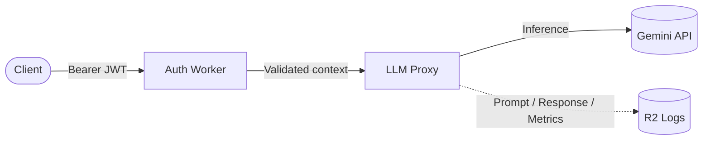
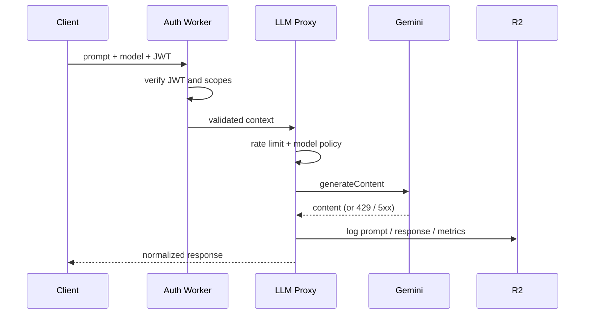
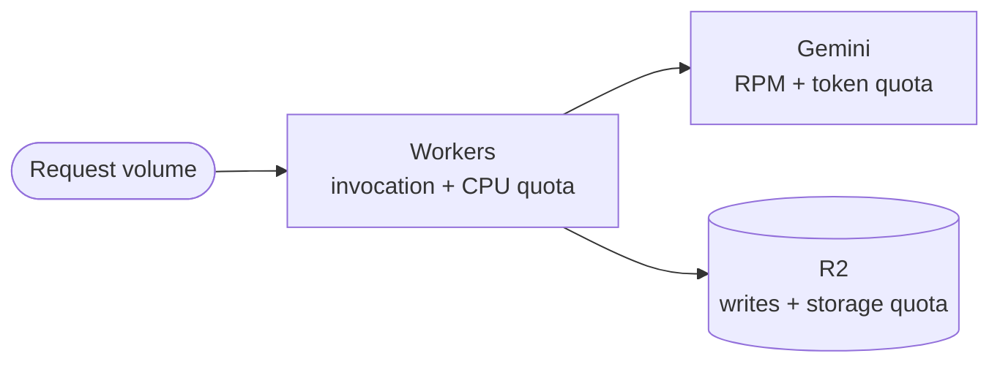

> **TL;DR** — Direct client-to-LLM is a security and observability dead end. A small AI gateway on Cloudflare Workers (Auth + Proxy), Gemini for inference, and R2 for audit logs gives you edge JWT validation, model allowlisting, native per-tenant rate limiting, and a durable prompt/response trail — all on free-tier quotas. The architecture is constrained but real, not a toy.

This post describes a production-style AI Gateway that runs entirely on free-tier infrastructure:

- **Cloudflare Workers** for the edge control plane
- **Gemini** free API tier for inference
- **R2** for prompt/response/metric audit logs
- **Stateless client auth** via Zustand

The goal is not a toy demo. The goal is a constrained but real gateway with guardrails, traceability, and predictable behavior under free limits.

---

## 1. Context & Problem

Direct client-to-LLM integration creates three problems that surface fast in production:

1. **Secret exposure risk** — API keys end up in client bundles or browser storage.
2. **No centralized policy** — no model allowlist, no per-tenant quotas, no abuse limits.
3. **No durable audit trail** — prompts and responses vanish into provider logs you do not own.

At small scale you can ignore this. In production you cannot.

---

## 2. Architecture Overview



Responsibilities are intentionally split:

- **Auth Worker** — identity, JWT validation, scope checks, tenant context.
- **LLM Proxy Worker** — model allowlist, payload normalization, response shaping, rate limiting.
- **R2** — immutable prompt/response logs and lightweight metrics.

The split matters: Auth is a security boundary, Proxy is a policy boundary, R2 is the durability boundary. Each can fail independently without compromising the others.

---

## 3. Auth Worker

The Auth Worker validates signed tokens and emits a compact security context for the proxy.

```ts
export async function validateRequest(request: Request, env: Env) {
  const auth = request.headers.get("authorization")
  if (!auth?.startsWith("Bearer ")) {
    return new Response("Unauthorized", { status: 401 })
  }

  const token = auth.slice(7)
  const payload = await verifyJwt(token, env.AUTH_JWKS_URL)

  if (!payload || payload.exp * 1000 < Date.now()) {
    return new Response("Invalid token", { status: 401 })
  }

  if (!payload.scopes?.includes("llm:invoke")) {
    return new Response("Forbidden", { status: 403 })
  }

  return {
    subject: payload.sub,
    tenantId: payload.tenant_id,
    plan: payload.plan ?? "free",
  }
}
```

Key decisions:

- JWT validation runs on the edge — no origin round-trip per request.
- Scope-based access (`llm:invoke`) keeps token power explicit.
- Tenant identity is forwarded as **structured context**, not the raw token. The proxy never sees the JWT.

---

## 4. LLM Proxy Worker

The proxy receives validated context, enforces model policy, forwards to Gemini, and normalizes output.

```ts
export async function proxyToGemini(input: GatewayInput, env: Env) {
  const allowedModels = new Set(["gemini-2.0-flash", "gemini-2.0-flash-lite"])

  if (!allowedModels.has(input.model)) {
    return new Response("Model not allowed", { status: 400 })
  }

  const upstream = await fetchWithRetry(
    `https://generativelanguage.googleapis.com/v1beta/models/${input.model}:generateContent?key=${env.GEMINI_API_KEY}`,
    {
      method: "POST",
      headers: { "content-type": "application/json" },
      body: JSON.stringify({
        contents: [{ role: "user", parts: [{ text: input.prompt }] }],
      }),
    }
  )

  if (upstream.status === 429) {
    return new Response("Rate limited upstream", {
      status: 429,
      headers: { "retry-after": upstream.headers.get("retry-after") ?? "30" },
    })
  }

  if (!upstream.ok) {
    return new Response("Upstream LLM error", { status: 502 })
  }

  const payload = await upstream.json<GeminiResponse>()
  const text = payload.candidates?.[0]?.content?.parts?.[0]?.text ?? ""

  return Response.json({ text, model: input.model })
}
```

Important constraints:

- No model passthrough from the client — only the allowlist.
- Standardized response schema: clients depend on `{ text, model }`, not on Gemini-specific fields.
- Upstream `429` is propagated with `Retry-After` so callers can back off correctly. `5xx` collapses to a clean `502`.

### Retrying upstream failures

```ts
async function fetchWithRetry(url: string, init: RequestInit, max = 3): Promise<Response> {
  let attempt = 0
  let lastResponse: Response | null = null
  while (attempt < max) {
    const res = await fetch(url, init)
    if (res.ok || res.status < 500) return res
    lastResponse = res
    const backoff = Math.min(2_000, 200 * 2 ** attempt) + Math.random() * 100
    await new Promise((r) => setTimeout(r, backoff))
    attempt++
  }
  return lastResponse ?? new Response("Upstream unavailable", { status: 502 })
}
```

Exponential backoff with jitter, capped at 3 attempts. Worker CPU time is bounded on the free tier; longer retries belong in a queue, not in the request path.

---

## 5. Rate Limiting

Cloudflare Workers expose a native rate-limiting binding. Use it for the cheap, IP-based first line of defense:

```jsonc
// wrangler.jsonc
{
  "ratelimits": [
    {
      "name": "GLOBAL_RL",
      "namespace_id": "...",
      "simple": { "limit": 100, "period": 60 }
    }
  ]
}
```

```ts
const { success } = await env.GLOBAL_RL.limit({ key: clientIp(request) })
if (!success) {
  return new Response("Too many requests", { status: 429 })
}
```

The native binding is per-IP and operates pre-request. For per-tenant quotas, layer a Worker-side counter keyed on `tenantId`:

```ts
const key = `rl:${ctx.tenantId}:${Math.floor(Date.now() / 60_000)}`
const count = (await env.RL_KV.get(key)) ?? "0"
if (Number(count) >= QUOTAS[ctx.plan]) {
  return new Response("Tenant quota exceeded", { status: 429 })
}
await env.RL_KV.put(key, String(Number(count) + 1), { expirationTtl: 120 })
```

Two layers, two purposes: native binding stops abusive traffic before it costs you CPU; tenant counter enforces fairness inside paid surface.

---

## 6. R2 Audit Storage

Bucket layout:

```text
llm-logs/
  ├── prompts/
  ├── responses/
  └── metrics/
```

Prompt/response are stored independently to keep write paths simple and queryable:

```ts
export async function persistR2Log(ctx: GatewayContext, data: GatewayLog, env: Env) {
  const ts = Date.now()
  const base = `${ctx.tenantId}/${ctx.subject}/${ts}`

  await Promise.all([
    env.LLM_LOGS.put(`llm-logs/prompts/${base}.json`, JSON.stringify(data.prompt), {
      httpMetadata: { contentType: "application/json" },
    }),
    env.LLM_LOGS.put(`llm-logs/responses/${base}.json`, JSON.stringify(data.response), {
      httpMetadata: { contentType: "application/json" },
    }),
    env.LLM_LOGS.put(`llm-logs/metrics/${base}.json`, JSON.stringify(data.metrics), {
      httpMetadata: { contentType: "application/json" },
    }),
  ])
}
```

`Promise.all` lets the three writes run in parallel; on free-tier R2 the cost is dominated by request count, not bytes, so batching small JSON objects per write is intentional. For higher volume, switch to a single combined object per request and an async fan-out queue.

---

## 7. Client State (Zustand)

The client keeps auth context in a minimal Zustand store and transmits only structured JSON.

```ts
import { create } from "zustand"

type SessionState = {
  token: string | null
  tenantId: string | null
  model: "gemini-2.0-flash" | "gemini-2.0-flash-lite"
  setSession: (input: { token: string; tenantId: string }) => void
  clear: () => void
}

export const useSessionStore = create<SessionState>((set) => ({
  token: null,
  tenantId: null,
  model: "gemini-2.0-flash",
  setSession: ({ token, tenantId }) => set({ token, tenantId }),
  clear: () => set({ token: null, tenantId: null }),
}))
```

Client state stays deterministic. The proxy contract stays explicit: the client cannot influence routing or model beyond what the allowlist permits.

---

## 8. Request Lifecycle



Six stages, each with a well-defined failure mode:

1. Client submits prompt + model
2. Auth Worker validates JWT and scopes (`401` / `403`)
3. Proxy enforces rate limit + model allowlist (`429` / `400`)
4. Gemini returns content (`502` on 5xx, `429` propagated)
5. Proxy logs prompt/response/metrics to R2 (best-effort, never blocks the response)
6. Client receives a normalized response

---

## 9. Cost Model (All Free Tier)



Designed around quota boundaries, not paid capacity:

- **Workers** — free invocation/runtime quotas
- **Gemini** — free model quota limits (RPM and tokens/day)
- **R2** — low-volume object writes + storage within free bucket limits

The system is "zero-cost" only while respecting traffic and token ceilings. The rate-limit layers above are also a cost-control mechanism, not just a security one.

---

## 10. Security Model

Controls applied:

- No LLM API key on the client
- JWT verification at the edge
- Scope + tenant checks before inference
- Model allowlist
- Native rate-limit binding + per-tenant counter
- Request logging for traceability
- Structured errors that do not leak internals

Recommended additions for hardening:

- Prompt content filtering layer (PII, abuse)
- Signed request IDs for chain correlation across logs
- Response sanitation (e.g., strip provider-specific fields)

---

## 11. Trade-offs

What this design optimizes:

- Fast control-plane logic at the edge
- Low operational overhead — no servers, no cluster
- Clean separation of concerns

What it sacrifices:

- A strict free-tier throughput ceiling
- Limited analytical depth without an external OLAP pipeline
- More complex retry semantics if the upstream is flaky (mitigated, not eliminated)

If any of these become real constraints, the gateway scales naturally to paid Workers + a queue + a real warehouse, without a redesign.

---

## 12. Extensions

Natural next steps:

- **KV/D1 index** for searchable request metadata
- **Async queue** for non-blocking write pipelines (Cloudflare Queues)
- **Multi-provider routing** — Gemini + a fallback provider on `429`/`5xx`
- **Per-tenant policy DSL** for model and tool permissions

---

## Key Takeaways

- An AI gateway is a security and policy boundary first. Every direct-to-LLM client design eventually has to add one.
- Split Auth and Proxy into separate Workers. The forwarded context is structured, never the raw token.
- Use Cloudflare's native rate-limit binding for IP-level abuse, then layer a tenant-scoped counter for fairness.
- Propagate upstream `429` with `Retry-After`. Collapse upstream `5xx` to a clean `502`.
- R2 is for durable audit logs, not for hot reads. Move analytical queries to KV/D1 or a warehouse.
- "Zero-cost" is a quota story, not a capacity story. Design backpressure in from day one.

---

## See Also

- [Designing Resilient Kafka Integrations](/blog/designing-resilient-kafka-integrations) — broader patterns for tolerating upstream failure.
- [Observability with Prometheus and Micrometer](/blog/observability-with-prometheus-and-micrometer) — what to instrument once the gateway grows past R2 audit logs.
